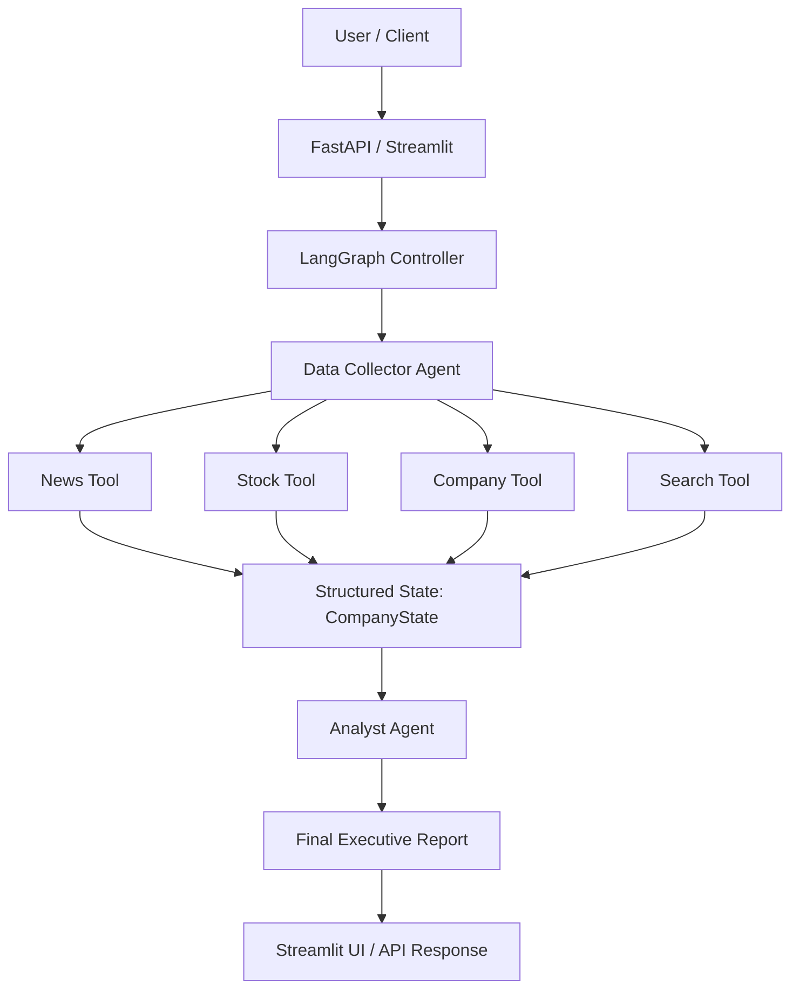
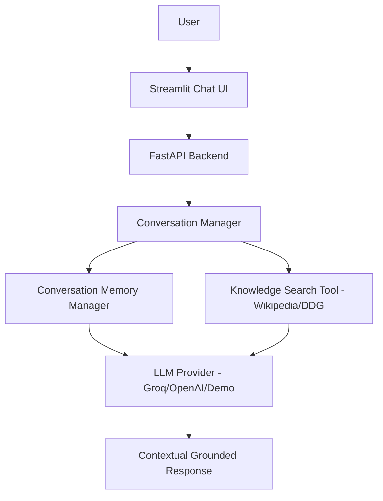

# 🧠 Soulpage GenAI Assignment — Sri Ram

A production-quality GenAI repository demonstrating an agentic AI system for corporate intelligence using **LangGraph StateGraph** multi-agent orchestration (Task 1) and a **Conversational Knowledge Bot** featuring grounding tool retrieval and message memory context resolution (Task 2).

---

## 📌 Executive Summary

- **Repository Name:** `Soulpage-genai-assignment-SriRam`
- **Primary Tech Stack:** Python 3.11+, LangGraph, LangChain, FastAPI, Streamlit, Pydantic, Pytest
- **Supported LLM Providers:** Groq (`llama-3.3-70b-versatile`), OpenAI (`gpt-4o-mini`), and Fallback `DemoChatModel`
- **Key Features:** Real multi-agent graph orchestration, strongly typed state, tool calling with error handling, session memory context resolution, FastAPI server, Streamlit frontend, end-to-end unit tests, and comprehensive interview documentation.

---

## 🏗️ Architecture & Agent Workflows

### Task 1: Multi-Agent Company Intelligence Workflow



### Task 2: Conversational Knowledge Bot Architecture



---

## 🛠️ Technology Stack & Dependencies

- **Language:** Python 3.11+
- **Agent Orchestration:** `langgraph` (`StateGraph`, `MemorySaver`)
- **LLM Abstraction & Tools:** `langchain`, `langchain-community`, `langchain-groq`, `langchain-openai`
- **API Framework:** `fastapi`, `uvicorn`, `pydantic`, `pydantic-settings`
- **UI Framework:** `streamlit`
- **External Search & Tools:** `wikipedia`, `duckduckgo-search`, `httpx`
- **Testing:** `pytest`, `httpx`, `fastapi.testclient`

---

## 📂 Project Structure

```
Soulpage-genai-assignment-SriRam/
│
├── README.md                          # Master documentation
├── requirements.txt                    # Project dependencies
├── .env.example                        # Environment configuration template
├── .gitignore                          # Git exclusion rules
├── LICENSE                             # MIT License
├── main.py                             # Unified CLI launcher
│
├── backend/                            # FastAPI Application
│   ├── __init__.py
│   ├── api.py                          # Router & endpoints (/health, /company/analyze, /chat)
│   └── server.py                       # Uvicorn server launcher
│
├── task1_company_intelligence/         # Task 1: Multi-Agent System
│   ├── __init__.py
│   ├── graph.py                        # LangGraph StateGraph definition
│   ├── state.py                        # Strongly-typed CompanyState
│   ├── workflow.py                     # High-level entrypoint & session wrapper
│   │
│   ├── agents/
│   │   ├── __init__.py
│   │   ├── data_collector.py           # Data Collector Agent
│   │   └── analyst.py                  # Analyst Agent
│   │
│   ├── tools/
│   │   ├── __init__.py
│   │   ├── news_tool.py                # News search tool
│   │   ├── stock_tool.py               # Stock quote tool (with demo_data marker)
│   │   ├── company_tool.py             # Company info tool
│   │   └── search_tool.py              # Web search tool
│   │
│   └── prompts/
│       ├── __init__.py
│       ├── collector_prompt.py         # System prompt for Data Collector
│       └── analyst_prompt.py           # System prompt for Analyst
│
├── task2_knowledge_bot/                # Task 2: Conversational Knowledge Bot
│   ├── __init__.py
│   ├── bot.py                          # Knowledge Bot & coreference pronoun resolver
│   ├── memory.py                       # Modern message memory manager
│   ├── tools.py                        # Wikipedia & DDG knowledge search tools
│   └── prompts.py                      # Knowledge bot system prompt
│
├── common/                             # Shared utilities
│   ├── __init__.py
│   ├── config.py                       # Pydantic/dotenv settings loader
│   ├── llm.py                          # Provider abstraction (Groq, OpenAI, Demo)
│   ├── logging_config.py               # Structured logger
│   └── utils.py                        # Helpers & source formatters
│
├── frontend/                           # Streamlit Web UI
│   ├── __init__.py
│   ├── app.py                          # Main Streamlit app entrypoint
│   ├── task1_ui.py                     # Tab 1 UI renderer
│   └── task2_ui.py                     # Tab 2 UI renderer
│
├── tests/                              # Pytest test suite
│   ├── __init__.py
│   ├── test_task1.py                   # State, agents, graph tests
│   ├── test_task2.py                   # Bot, memory, API tests
│   ├── test_tools.py                   # Tool execution tests
│   └── test_memory.py                  # Conversation memory tests
│
├── notebooks/                          # Jupyter Notebooks
│   └── assignment_demo.ipynb           # End-to-end runnable demonstration notebook
│
├── docs/                               # Detailed Architecture & Interview Docs
│   ├── architecture.md                 # Complete architecture document
│   └── interview_walkthrough.md        # 20-question interview walkthrough
│
├── data/                               # Mock Data
│   └── mock_company_data.json          # Demo fallback datasets
│
└── screenshots/                        # Visual artifacts & placeholders
    └── README.md
```

---

## ⚡ Quick Start & Installation

### 1. Clone & Change Directory
```bash
git clone https://github.com/your-username/Soulpage-genai-assignment-SriRam.git
cd Soulpage-genai-assignment-SriRam
```

### 2. Set Up Virtual Environment & Dependencies
```bash
python -m venv venv
# On Windows:
venv\Scripts\activate
# On Linux/macOS:
source venv/bin/activate

pip install -r requirements.txt
```

### 3. Configure Environment Variables
Copy `.env.example` to `.env`:
```bash
cp .env.example .env
```
*(If no API keys are provided, `DEMO_MODE=true` will automatically serve fallback mock data so the app runs cleanly!)*

---

## 🚀 Execution Commands

The repository includes a unified launcher (`main.py`):

### Run CLI End-to-End Demo
```bash
python main.py demo
```

### Run FastAPI Backend Server
```bash
python main.py server
# Server starts at http://localhost:8000
# OpenAPI Docs available at http://localhost:8000/docs
```

### Run Streamlit Web Application
```bash
python main.py ui
# Opens interactive UI in browser at http://localhost:8501
```

### Run Pytest Test Suite
```bash
python main.py test
# Or directly:
pytest -v
```

---

## 💬 Example Task 2 Follow-Up Conversation

```
User: Who is the CEO of OpenAI?
Bot: Sam Altman is the Chief Executive Officer (CEO) of OpenAI.
Sources:
1. Sam Altman (Wikipedia)

User: Where did he study?
[Context Query Resolver]: "Where did he study?" -> Rewritten to "Sam Altman education university"
Bot: Sam Altman attended Stanford University to study computer science, but dropped out in 2005 to co-found Loopt.
Sources:
1. Sam Altman Early life and education (Wikipedia)
```

---

## 🛡️ Key Design Decisions & Interview Highlights

1. **Stateful Graph Orchestration**: Uses LangGraph `StateGraph` instead of simple chains for Task 1 to allow inspectable state passing and multi-agent coordination.
2. **Fact vs. Analysis Separation**: Analyst Agent explicitly categorizes Facts, Analysis, Risks, and Opportunities to prevent hallucinations.
3. **Coreference Pronoun Resolution**: Task 2 automatically resolves "he", "she", "they", or "that company" to previously mentioned entities using conversation state.
4. **Resilient Fallbacks & Demo Mode**: Network timeouts or absent API keys route gracefully to `DemoChatModel` and marked demo datasets (`"demo_data": true`).
5. **No Deprecated APIs**: Uses modern LangChain message schemas (`HumanMessage`, `AIMessage`, `SystemMessage`) and LangGraph 2026-compatible paradigms.

---

## 🔒 Security

- No hardcoded API keys or secrets in source code.
- `.env` excluded via `.gitignore`.
- Structured logging masks sensitive data.

---

## 🐙 Git Repository Commands

```bash
git init
git add .
git commit -m "Build LangGraph multi-agent and conversational knowledge systems"
git branch -M main
git remote add origin https://github.com/<YOUR_GITHUB_USERNAME>/Soulpage-genai-assignment-SriRam.git
git push -u origin main
```
