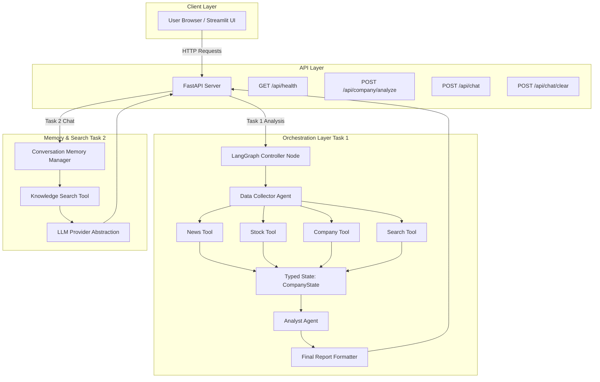
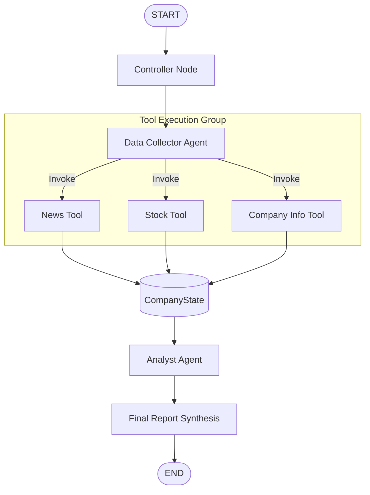
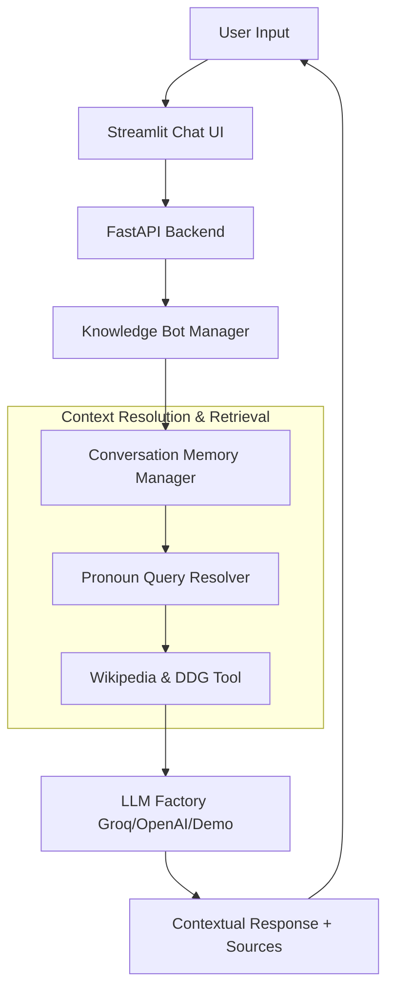

# 🏗️ Architecture Documentation

## Overview

The **Soulpage GenAI Assignment Repository** is designed with a clean, decoupled architecture separating LLM provider logic, multi-agent orchestration, state persistence, tools, backend APIs, and frontend presentation.

---

## 1. System Architecture Overview



---

## 2. Task 1: Multi-Agent Company Intelligence Pipeline



### Key Workflow Steps:
1. **Controller Node**: Validates input string, assigns session ID, initializes `CompanyState`.
2. **Data Collector Agent**: Concurrently executes `get_company_info`, `get_company_news`, and `get_stock_data`. Populates collected data and preserves source URLs.
3. **Analyst Agent**: Evaluates state, categorizes Facts, Analysis, Risks, and Opportunities using `AnalystPrompt`, and outputs structured markdown report.

---

## 3. Task 2: Conversational Knowledge Bot Architecture



---

## 4. Provider Abstraction & Fallback Pattern

The application implements a provider abstraction layer (`common/llm.py`):

```
                   +-----------------------+
                   |  common.llm.get_llm() |
                   +-----------+-----------+
                               |
         +---------------------+---------------------+
         |                     |                     |
         v                     v                     v
   +-----------+         +-----------+         +-----------+
   | ChatGroq  |         |ChatOpenAI |         | DemoModel |
   +-----------+         +-----------+         +-----------+
   (If Groq Key)         (If OpenAI Key)       (Fallback Mode)
```

If API keys are omitted or `DEMO_MODE=true`, the system dynamically routes calls to `DemoChatModel`, ensuring that **all tests and demonstrations execute without runtime errors or crashes**.
